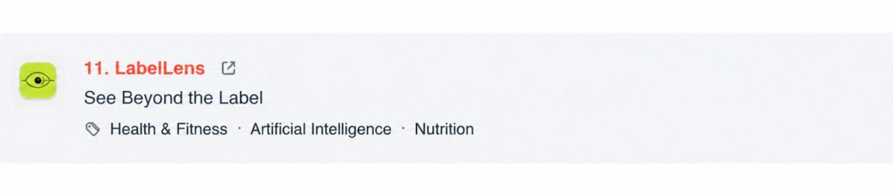

  

  <strong>🚀 LabelLens — Featured #10 on Product Hunt</strong>
   
  <em>The AI-Powered Food Nutrition Scanner & Health Intelligence Platform</em>

  
  
  
  
  
  
  

---

# LabelLens — See Beyond the Label

**LabelLens** is a modern, full-stack AI web application designed to help consumers instantly decode complex packaged food labels. By snapping a photo or uploading an image of a food nutrition panel and ingredients list, users receive an objective **1-10 Health Score**, an explainable breakdown of positive and negative factors, allergen alerts, hidden additive detection, personalized dietary compatibility, and side-by-side product comparisons.

---

## 🌟 Key Features

### 1. Instant Vision AI Label Scanner
- Upload or capture food nutrition tables and ingredient lists on mobile or desktop.
- High-speed vision analysis powered by Groq's low-latency inference.
- Validates image authenticity and confirms whether an uploaded image contains a legitimate food label.

### 2. Explainable 1–10 Health Scoring
- Weighted scoring system inspired by WHO guidelines and clinical nutrition standards.
- Detailed macro breakdown: **Sugar**, **Sodium**, **Additives**, **Protein**, and **Fiber**.
- Score breakdown chips showing specific positive (+points) and negative (-points) contributors.

### 3. Side-by-Side Product Comparison (/compare)
- Compare two food product labels simultaneously.
- Automatic winner determination with human-readable rationale.
- Goal-by-goal winner breakdown (Weight Loss, Muscle Gain, General Health, Diabetes Friendly, Heart Health).

### 4. Interactive Ingredient Deep-Dive
- Tap any ingredient in the product's ingredient list to open a slide-over panel.
- Explains what the ingredient is, why manufacturers use it, health concerns, and regulatory/scientific safety ratings (safe, caution, void).

### 5. Ask AI Product Chat
- Ask contextual nutrition questions about any scanned food product.
- Built-in one-tap presets: *\"Is this good for gym?\"*, *\"Is this safe for diabetics?\"*, *\"Is this suitable for children?\"*, *\"Is this good for weight loss?\"*.

### 6. Personalization & Allergy Safety
- User onboarding wizard to configure **Health Goals** and **Dietary Preferences** (Vegetarian, Vegan, Jain).
- Multi-tier allergen monitoring (Milk, Eggs, Peanuts, Tree Nuts, Gluten, Soy, Shellfish, Fish, Sesame, etc.).
- Custom avoided ingredients filter (e.g. Palm Oil, Aspartame, High Fructose Corn Syrup, MSG).

### 7. User Dashboard & History
- Secure Google OAuth 2.0 authentication and JWT session management.
- Paginated scan history with search filtering and sorting (by date, score high-to-low, score low-to-high).
- Health analytics dashboard tracking scan averages, best products, and most common red flags.

### 8. Shareable Social Result Cards
- Generates polished, high-resolution result cards ready for sharing across Twitter/X, WhatsApp, Instagram, or clipboard.

### 9. Lemon Squeezy Pro Subscriptions & Monetization
- Turnkey monetization engine with freemium scan limits (3 free scans, then Pro paywall).
- In-app Lemon.js overlay checkout for frictionless conversions.
- Webhook processor for automatic plan activation, renewals, and cancellations.

---

## 🏗️ Technical Architecture

`
labellens/
├── client/                      # React 18 SPA (Vite + Tailwind CSS + Framer Motion)
│   ├── public/                  # Static assets, logos, sitemap.xml, robots.txt
│   ├── src/
│   │   ├── components/          # Reusable UI (AnalysisResult, GoalScores, IngredientList, Navbar, SEO, etc.)
│   │   ├── contexts/            # React AuthContext (authentication & user profile state)
│   │   ├── hooks/               # useAnalyze hook for upload & scan lifecycle
│   │   ├── pages/               # Landing, Scan, Compare, Dashboard, History, ScanDetail, Profile, Settings
│   │   ├── services/            # Axios API client with automatic JWT token injection & error handling
│   │   └── utils/               # Scoring color mappings, canvas share card generator
│   └── .env.example             # Frontend environment template
│
├── server/                      # Express REST API (Node.js + MongoDB + Groq SDK)
│   ├── config/                  # MongoDB database connection with validation
│   ├── controllers/             # Business logic (analyze, auth, chat, compare, history, ingredient, user)
│   ├── middleware/              # JWT auth, optional auth, and Multer image upload filter
│   ├── models/                  # Mongoose Schemas (User, ScanHistory, ChatHistory, UserPreferences, AllergyProfile)
│   ├── routes/                  # Express route routers with IP rate-limiting
│   ├── scripts/                 # Maintenance, DB test, model check, and pipeline test utilities
│   ├── services/                # Allergy detector, Azure blob storage, JWT service
│   └── .env.example             # Backend environment template
│
├── .env.example                 # Root master environment template
├── netlify.toml                 # Netlify deployment configuration with security headers
└── render.yaml                  # Render web service blueprint
`

---

## 🚀 Quickstart & Local Setup

### Prerequisites
- **Node.js**: v20.19+ or v22+
- **MongoDB**: Local instance running on port 27017 or a free [MongoDB Atlas](https://www.mongodb.com/atlas) cluster
- **Groq API Key**: Free API key from [Groq Console](https://console.groq.com/keys)

### 1. Clone & Install Dependencies
`ash
# Clone the repository
git clone <your-repo-url> labellens
cd labellens

# Install root, client, and server dependencies
npm install
cd client && npm install
cd ../server && npm install
cd ..
`

### 2. Configure Environment Variables
Copy the example environment files:
`ash
# Backend environment
cp server/.env.example server/.env

# Frontend environment
cp client/.env.example client/.env
`

Open server/.env and supply at least:
`env
PORT=5000
MONGODB_URI=mongodb://localhost:27017/labellens
GROQ_API_KEY=your_actual_groq_api_key
JWT_SECRET=your_secure_jwt_secret_key
`
*(Note: Google OAuth and Azure Storage are optional. If not configured, the app runs smoothly with guest scanning, compare, and all AI features intact!)*

### 3. Start Development Servers
From the repository root, start both client and server concurrently:
`ash
npm run dev
`

- **Frontend Application**: http://localhost:5173
- **Backend API Server**: http://localhost:5000
- **API Health Check**: http://localhost:5000/health

---

## ⚙️ Environment Variables Reference

| Variable | Scope | Required | Description |
|---|---|---|---|
| PORT | Server | No (default: 5000) | Express HTTP port |
| NODE_ENV | Server | No | development or production |
| CLIENT_ORIGIN | Server | Yes | Allowed CORS origin(s), comma-separated |
| CLIENT_URL | Server | Yes | Base URL of frontend (e.g. http://localhost:5173) |
| MONGODB_URI | Server | Yes | MongoDB connection string (local or Atlas) |
| GROQ_API_KEY | Server | Yes | Groq API key for vision and LLM models |
| GROQ_VISION_MODEL| Server | No | Vision model identifier (default: qwen/qwen3.8-27b) |
| GROQ_CHAT_MODEL | Server | No | Chat model identifier (default: qwen/qwen3.8-27b) |
| JWT_SECRET | Server | Yes | Random secret string used to sign JWT session tokens |
| JWT_EXPIRES_IN | Server | No (default: 7d) | JWT token lifespan (e.g. 7d, 30d) |
| GOOGLE_CLIENT_ID | Server | Optional | Google OAuth 2.0 Client ID for Google Sign-In |
| GOOGLE_CLIENT_SECRET| Server | Optional | Google OAuth 2.0 Client Secret |
| GOOGLE_CALLBACK_URL | Server | Optional | OAuth callback URL (e.g. .../api/auth/google/callback) |
| AZURE_STORAGE_CONNECTION_STRING | Server | Optional | Azure Blob Storage connection string (image archiving) |
| AZURE_STORAGE_CONTAINER_NAME | Server | Optional | Azure Blob container name |
| LEMON_SQUEEZY_CHECKOUT_URL | Server | Yes | Direct Lemon Squeezy checkout link for Pro subscription |
| LEMON_SQUEEZY_WEBHOOK_SECRET | Server | Yes | Webhook signing secret configured in Lemon Squeezy dashboard |
| VITE_API_URL | Client | Yes | Backend URL (e.g. http://localhost:5000) |
| VITE_LEMON_SQUEEZY_CHECKOUT_URL | Client | Yes | Frontend Lemon Squeezy checkout link for overlay modal |

---

## 📡 API Reference

### Health
- GET /health — Check server status and timestamp.

### Analysis & AI
- POST /api/analyze — Multipart form (label: image file, optional userContext JSON). Returns structured nutrition score, breakdown, allergen alerts, and red flags. Enforces free scan limit (3 scans) for non-subscribers.
- POST /api/compare — Multipart form (labelA: image, labelB: image). Side-by-side comparison and category winner analysis.
- POST /api/ingredient-explain — JSON body (name or ingredient). Returns comprehensive ingredient profile and safety rating.
- POST /api/chat-about-product — JSON body (question, productData, optional scanId). Contextual Q&A on nutrition facts.

### Billing & Monetization
- POST /api/billing/webhook — Lemon Squeezy webhook handler (subscription created, updated, cancelled, expired, order created) with HMAC SHA-256 signature verification.
- GET /api/billing/status — Returns current user subscription tier, remaining free scans, and checkout link.

### Authentication & User
- GET /api/auth/google — Initiates Google OAuth 2.0 flow.
- GET /api/auth/google/callback — Google OAuth redirect handler.
- GET /api/auth/me — Returns current authenticated user (Bearer token required).
- POST /api/auth/logout — Ends user session.
- GET /api/user/profile — Full profile (user data, health goals, dietary preferences, allergens, avoided ingredients).
- GET /api/user/settings — User preferences (e.g., saveImages setting).
- PUT /api/user/settings — Updates user settings.
- PUT /api/user/preferences — Updates health goals and dietary preferences.
- PUT /api/user/allergies — Updates common and custom allergen lists.
- PUT /api/user/avoided — Updates custom avoided ingredients list.
- DELETE /api/user/account — Deletes user account and associated history completely.

### History & Stats
- GET /api/history — Paginated scans with search and sorting (sortBy=healthScore|createdAt, sortDir=asc|desc).
- GET /api/history/stats — User scan statistics (total scans, average score, highest/lowest product, top red flag).
- GET /api/history/summary — Combined recent scans and dashboard stats.
- GET /api/history/:id — Single scan result by ID.
- DELETE /api/history/:id — Deletes scan and associated cloud image.

---

## 🛡️ Security & Reliability Features
- **Centralized Error Handling**: Express middleware intercepts Multer file limits, malformed JSON, and CORS rejections, returning clean { success: false, error: '...' } responses.
- **DDoS & Quota Protection**: Strict IP rate limiting applied across analysis, comparison, chat, and ingredient endpoints.
- **Graceful OAuth Fallback**: Automatically disables Google Sign-In if keys are omitted, without crashing the server process.
- **Input Sanitization**: Regular expression search parameters are automatically escaped to guard against query injection and ReDoS.
- **Frontend Error Boundary**: High-reliability React ErrorBoundary prevents white-screen crashes on uncaught render issues.

---

## 🚢 Production Deployment

### 1. Deploy Frontend to Netlify
1. Connect repository to [Netlify](https://netlify.com).
2. Set Base directory to client.
3. Set Build command to 
pm run build and Publish directory to dist.
4. Add environment variable:
   `
   VITE_API_URL=https://your-backend-api.onrender.com
   `
5. Netlify uses 
etlify.toml for automatic SPA routing and caching headers.

### 2. Deploy Backend to Render
1. Connect repository to [Render](https://render.com).
2. Create a new **Web Service** with:
   - **Root Directory**: server
   - **Build Command**: 
pm install
   - **Start Command**: 
pm start
3. Add the required environment variables (MONGODB_URI, GROQ_API_KEY, JWT_SECRET, CLIENT_ORIGIN, CLIENT_URL).

---

## 📄 License
Proprietary / Commercial software. All rights reserved.
